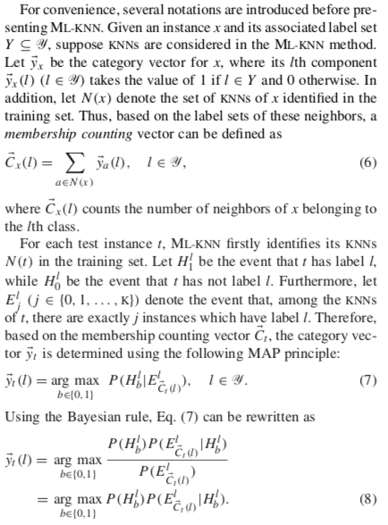
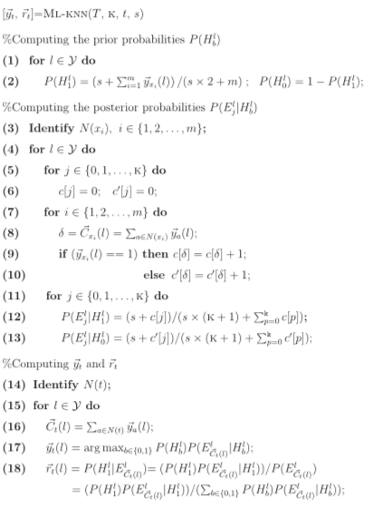

# Multi-Label-KNN

## Introduction

Multi-label learning originated from the investigation of text categorization problem, where each document may belong to several predefined topics simultaneously. In multi-label learning, the training set is composed of instances each associated with a set of labels, and the task is to predict the label sets of unseen instances through analyzing training instances with known label sets.  

This algorithm is created by Min-Ling Zhang, Zhi-Hua Zhou in Nanjing University in 2007, Our group use it to predict drug activity and our paper is published in *Front. Genet.*, DOI: 10.3389/fgene.2019.00474. We also make a online [website](http://zhanglab.hzau.edu.cn) which enables you to predict your drugs' activity for a single one or in batch.

In this repo, a R-version MLKNN algorithm which specificlly focuses on drug prediction is provided and the original paper  can be found in this repo too.

## Keywords

Machine learning; Multi-label learning; Lazy learning; K-nearest neighbor; Drug activity prediction;

## How it works

## Pseudo-Code

## About the R codes

**MLKNN.R**: Main program to compute probabilities.

**cv.MLKNN.R**: Performing cross validation on dataset.
   
**HammingLoss.R**: *Hamming loss*: evaluates how many times an instance– label pair is misclassified, i.e. a label not belonging to the in- stance is predicted or a label belonging to the instance is not predicted.    

**AveragePrecision.R**:*Average precision*: evaluates the average fraction of labels ranked above a particular label y ∈ *Y* which actually are in *Y*.   

**Coverage.R**:*Coverage*: evaluates how far we need, on the average, to go down the list of labels in order to cover all the proper labels of the instance.    

**OneError.R**: *One-error*: evaluates how many times the top-ranked label is not in the set of proper labels of the instance.     

**RankingLoss.R**:*Ranking loss*: evaluates the average fraction of label pairs that are reversely ordered for the instance.   

## The Original Paper

[https://cs.nju.edu.cn/zhouzh/zhouzh.files/publication/pr07.pdf](https://cs.nju.edu.cn/zhouzh/zhouzh.files/publication/pr07.pdf) 
